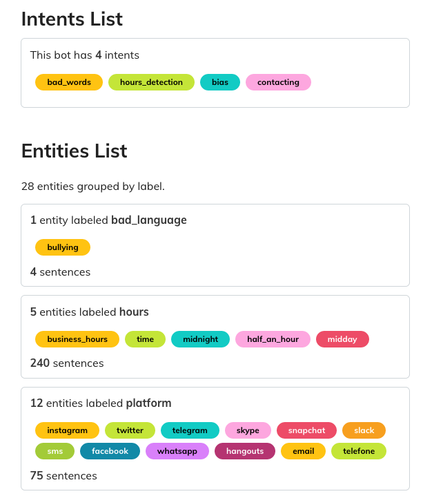
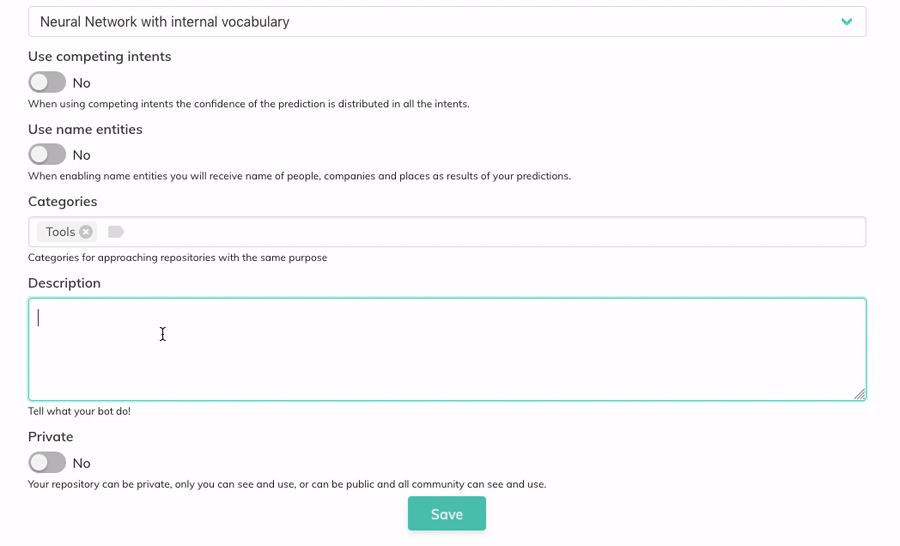
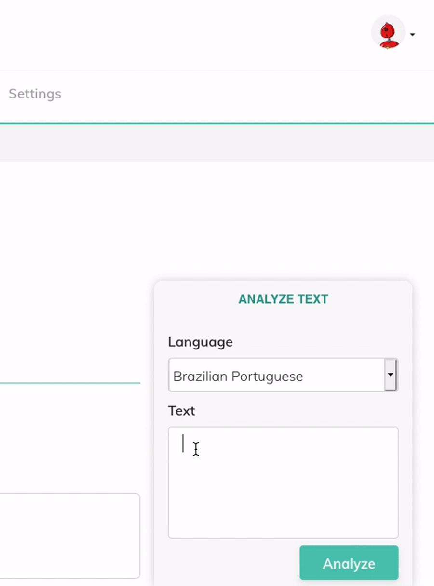
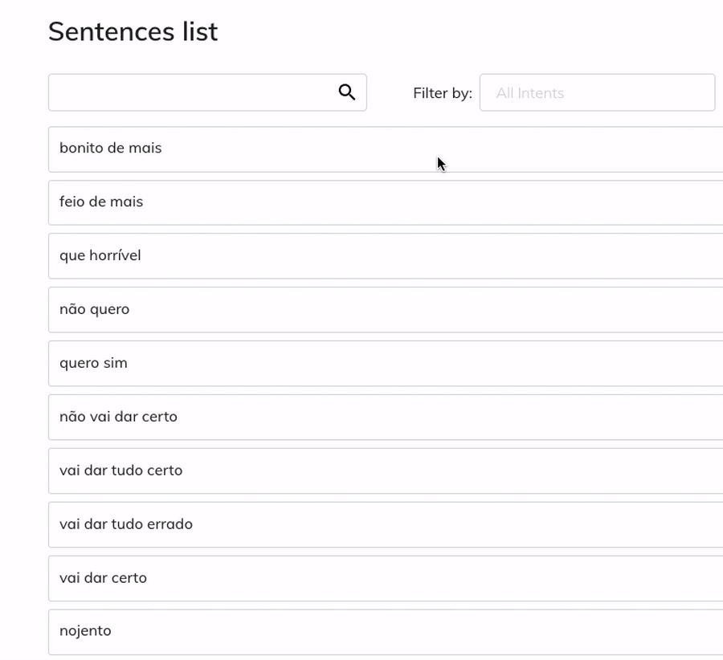
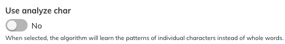

**Bug fixes, better models and speed have been the main focus of this new update**

Bothub has just released a new version and this post will highlight the new main changes. This release focused on updating our legacy Rasa version and fixing the stability problems we have been facing ever since we acquired more users. As a consequence of these changes, Bothub is now faster than ever and finally capable of handling the amount of requests necessary for handling the new [RapidPro](https://rapidpro.io/) integration.

## Newly Added Features

### UI Changes

The _summary_ screen has been redesigned to look prettier than it used to be. The entities and labels now appear colored and much mure organized (instead of the old greyish labels):

Besides that, you can now write your formatting in Markdown:

The repositories are now ranked by the most popular ones. To accomplish that we are temporarily using the number of executed evaluations, but this metric may change in the future.

The _"analyze text"_ window finally works by just typing Enter and has a new icon to copy the JSON content into the clipboard:

The training screen was refactored to show all the training samples without the need to select a specific intent. If you want to see examples of a single intent, you can select it in the filter:

### Back-end Changes

During this month, we've been working on migrating all the old routes from `v1` to `v2`. The new routes can be consulted and tested at https://api.bothub.it/.

As of this version, Bothub allows each repository to use a self-hosted NLP instance if you want. This setting isn't available in the front-end yet, but it will be soon.

### NLP Changes

We've updated the version of Rasa to `1.4.3` and of SpaCy to `2.1.9`. This changes bring all of their [latest improvements](https://explosion.ai/blog/spacy-v2-1) to Bothub as well. Besides that, the NLP API now makes use of [FastAPI](https://fastapi.tiangolo.com/) instead of [Tornado](https://www.tornadoweb.org/en/stable/), making the responses faster.

We now successfully cache the language embeddings in a way that they can be shared among many Bothub-NLP instances, which means we can now run tens of instances and use just a small amount of memory. Also the Rasa code was better isolated, making future Rasa updates easier than ever.

There is a new switch available in the Settings screen, the _"Use analyze char"_ option. This option makes some predictions better for languages that have complicated morphological variations of certain words, such as the [Romance languages](https://en.wikipedia.org/wiki/Romance_languages) and, with enough examples, it can make the models more robust against mistypes.

The NLP routes can be consulted at https://nlp.bothub.it.

### Roadmap

This was the first official Bothub update, which is why we decided to cover the main changes we've done so far. Many of the features we introduced are far from polished. We still have plans to roll out a better permissions system that will allow repository owners to define customized permission groups.

Aside from that, we have plans to experiment with better visualizations and add features such as issues tracker and dataset forking. Stay tuned!